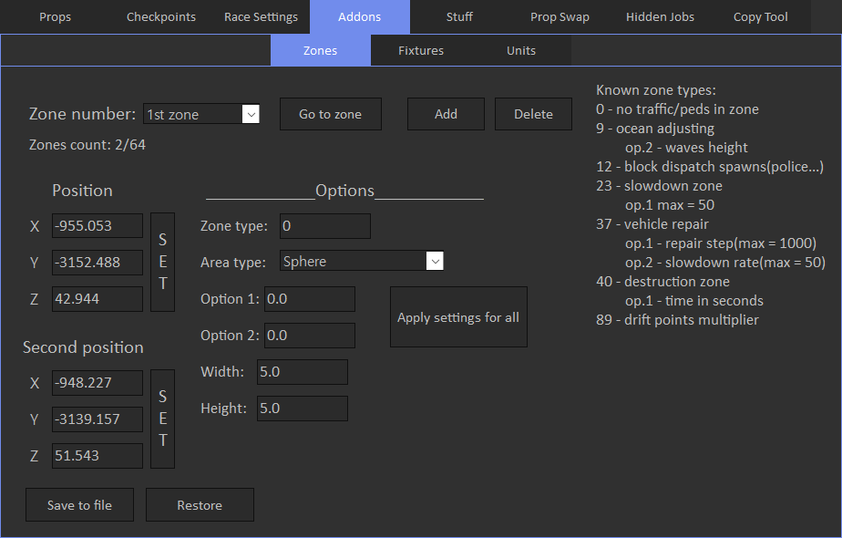

# Zones

Zones tab allows to view or modify zones.

In creator zones menu is located here:

Zone types Axis alligned box, Non-axis alligned box and Cylinder have 2 sets of coordinates, bottom and top.

In the tool, Position corresponds to the bottom coordinates, Second position corresponds to the top ones.

You can change width of the cylinder by editing Width field in the tool.

Sphere type has only center coordinates that are set in Position fields.
You can change it's size by editing Width field.

Also some zones can be configures with Option 1 and Option 2 fields.
You can see what each option does in the Known zone types hint in the tool.

Worth noticing that bottom Z coordinate should be a little below water/ground, for zone types like waves adjusting. 
It makes sure that zone will fully cover the area.

For example waves adjusting zone, it's above and below water.

