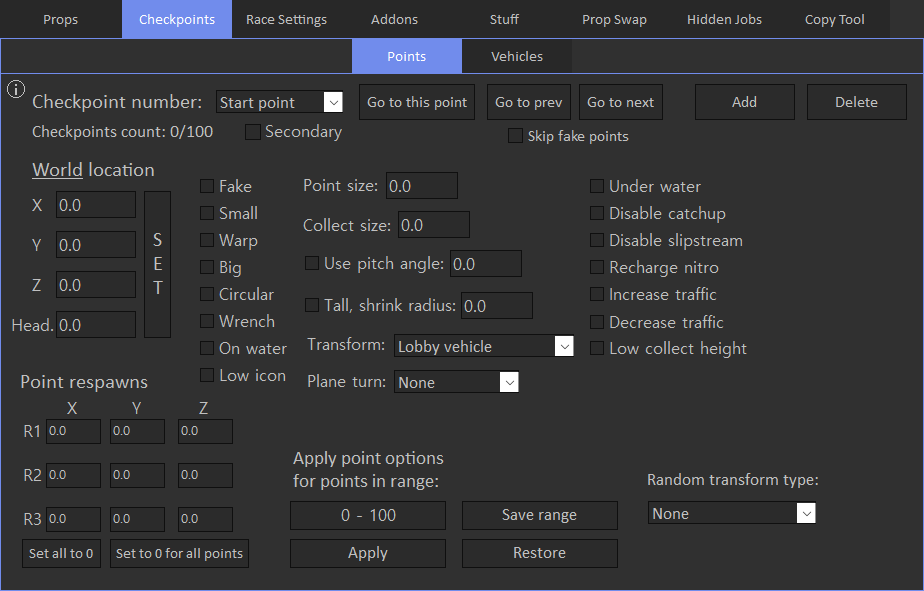

# Points

Points tab allows to view and modify placed checkpoints.

'Secondary' checkbox is used to toggle between settings of primary and seconary points.

Location tips: 

- 'SET' button sets cursor position to the appropriate location fields.
- Location supports arrow control(it depends on world/local alignment), more on [Arrow Control](../../../tips/arrow-control) page.

Point size option sets visual size of checkpoint, but it doesn't affect it's collect size.

Collect size option sets distance from which checkpoint can be collected, but it doesn't affect it's visual size. To make point collect only in the center, change this value to 0.1.

Go to buttons:

- Go to this point: teleport player to the selected point.
- Go to prev: teleport player to the previous point.
- Go to next: teleport player to the next point.

Point respawns set 3 respawn positions. Player will be spawned on one of the non-zero respawns. If all 3 respawn positions are set to zero, player will be always spawned in the center of checkpoint.

R1, R2, R3 correspond to the following positions:

Random transform supports 2 options: transform list and available vehicles:

- Transform list: random vehicle will be picked up from the transform vehicles list.
- Available vehicles: there are no settings for this type in the tool, but you can configure it 'Race Details' -> 'Random Vehicles' in the race creator.
Basically it picks random vehcile from selected categories, so there is a wider range of vehicles to be transformed into, compared to the 'Transform list' option.

Other options seem to be self-explanatory, you can play around with them for better understanding.