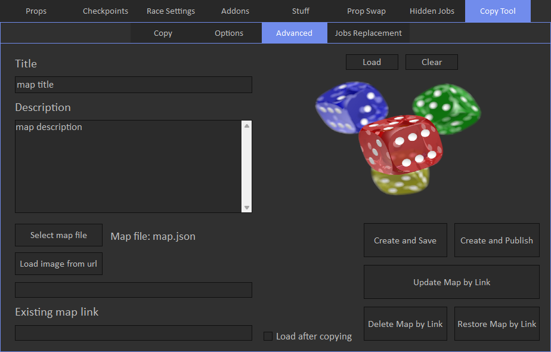
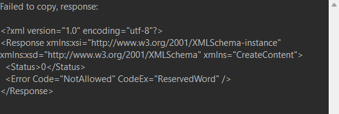

# Advanced

Advanced tab allows to upload custom map files.

First you need to select map json file. You can get it by activating 'Save map file' checkbox on [Copy](../../../copy-tool/copy/overview) tab and loading a map.
'map.json' file will be saved in the same directory with mod tool.

You can update map title or description in the appropriate fields and it will be included when copying or updating map.
You don't have to re-select map file after modifying it with some editor.

You can also load map image from local file or from URL.

'Create and Save' will create map based on selected json file and will put it in the Saved jobs.

'Create and Publish' will create map based on selected json file and will put it in the Published jobs.

'Update Map by Link' requires 'Existing map link' field to be set. It will update map by specific link, and it will not publish it, if you map is currently is in Saved jobs.

'Delete/Restore Map by Link' also requires 'Existing map link' field to be set. You can restore maps that were deleted not long ago.

**Note**: Create and Update options affect copy limit. Delete and Restore do not.

**Note**: Update/Delete/Restore options work only with maps that belong to you, it means you cannot modify maps from other creators.

If 'Load after copying' checkbox is not set, you can copy maps from story mode, no need to load in creator.

In case map was failed to copy, you'll see window that contains error information in XML format:

You can get link of currently loaded map in creator by pressing 'Copy job link' on [Map Options](../../../race-settings/map-options/overview) tab.