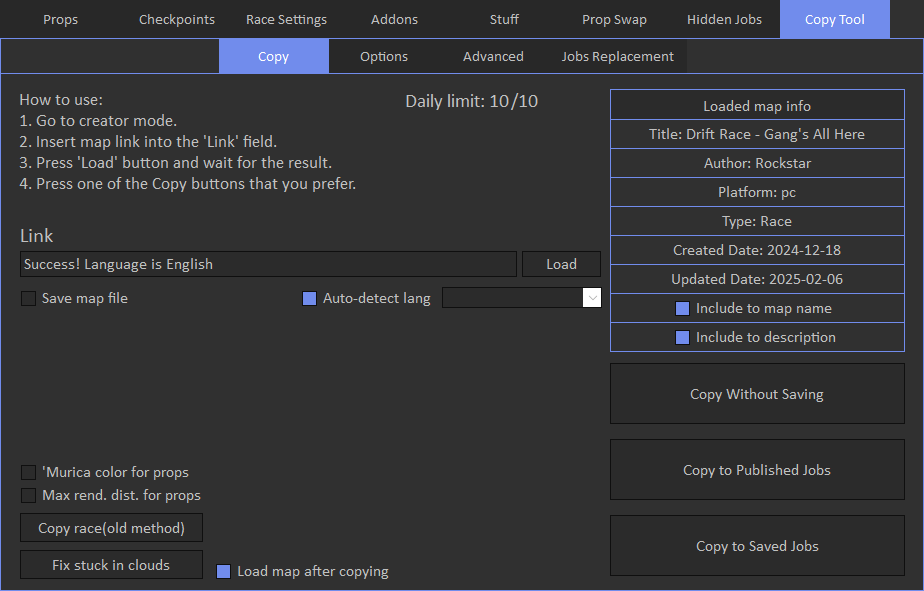

# Copy

Copy feature is not publicly accessible. It allows to copy maps from other platform(ps5, xbox,...) only to pc.

**Note**: if you don't want people to copy maps from you, DM me on discord and I'll restrict your account from copying.

To copy maps first enter global creator mode(by pressing 'Load Creator' button), then follow instruction from the tool.

Copy tool has daily limit of 10 maps.

'Copy Without Saving' will only load job in the creator without saving or publishing. 

'Copy to Published Jobs' will instantly publish and load job in the creator.

'Copy to Saved Jobs' will instantly save and load job in the creator. Job will not be published.

'Copy race(old method)' is legacy method. It works only for races. 
To use it, first load race creator, load a map by link in the tool and press 'Copy race' button. 
This option will only load race in the creator without saving or publishing.

'Save map file' options will save map json file in the same directory where tool is localated when you load a map by link.

'Save .mapx file' options will save map as .mapx file also in the same directory with mod tool. You can restore this map file on the [Map Options](../../../race-settings/map-options/overview) tab.

'Include to map name' and description options will add info about original platform and author. You can configure it on the [Options](../../../copy-tool/options/overview) tab.