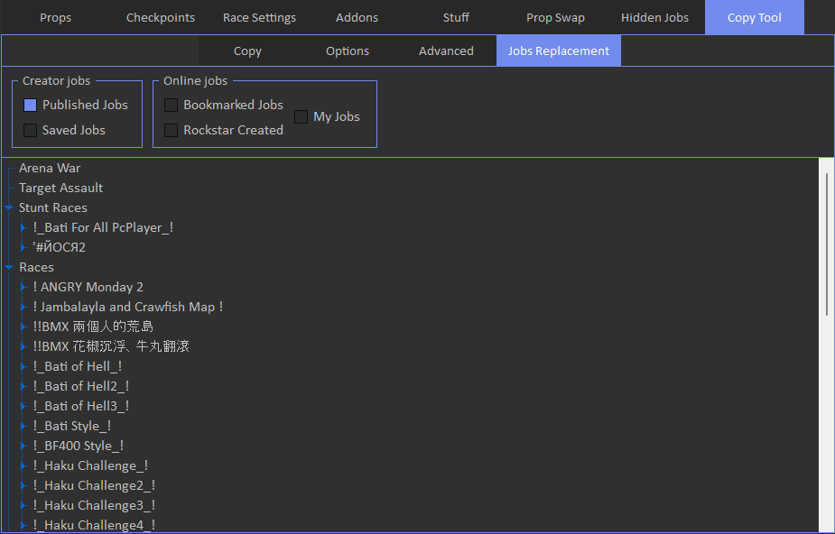

# Jobs Replacement

Jobs replacement tab allows to modify jobs info.

First enter published or saved jobs menu in the creator, then select appropriate option in the tool.

Note that changes are only applied locally, it means if you change job link or job type, it will not actually be changed on your map. 
Online options seem to be useless now, since you cannot enter online mode without BE.

It's like an alternative way to copy jobs, but only from pc.

By double-clicking on the job link field, you can paste a new one, then you can load this job in the creator.

You can also change job type by double-clicking on it. For example, if you change type from capture to race, job will be loaded in the race creator, instead of the capture creator.