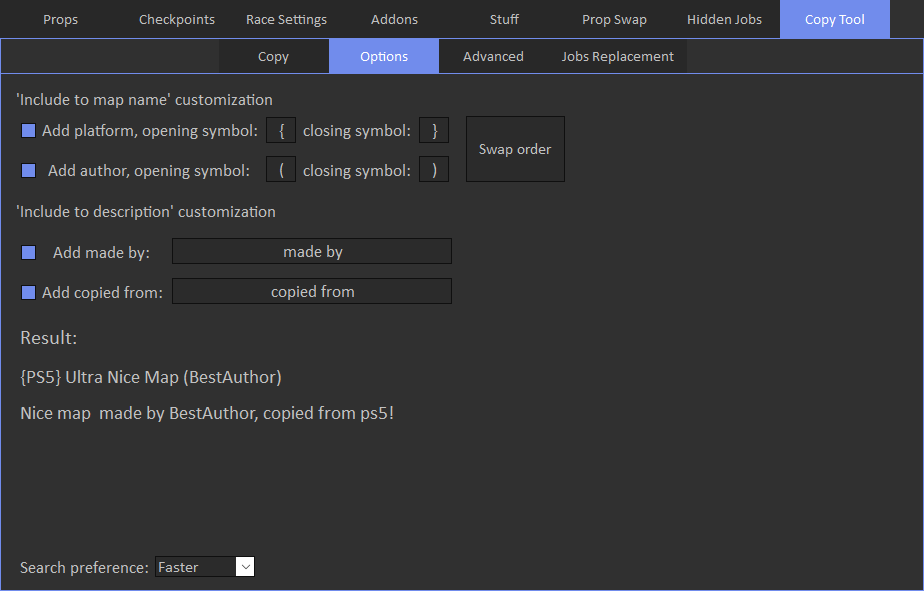

# Options

Options tab allows to customize info that will be added to the copied map.

On the copy tab, if 'Include to map name' is enabled, copied map platform and author will be added to the map in the way it's showed in example.
if 'Include to description' is enabled, made by text will be added to the map description.

'Search preference' usually shouldn't be changed at all, unless you can't load any map by link on the copy tab.