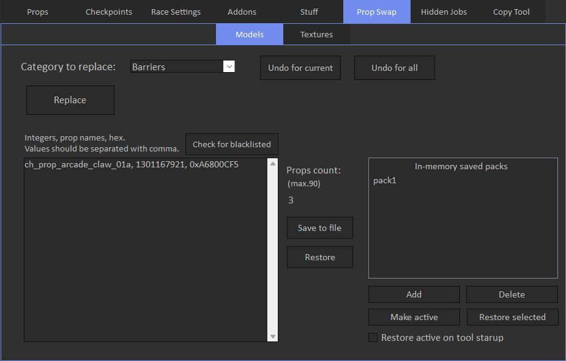

# Models

Models tab allows to replace stock creator props with custom ones.

You can replace props in different categories, also you can save or load prop packs.

Replaced props will appear in the props category that you selected.

You can add prop packs in the tool memory and make one of them active, this will auto restore pack when you open the tool,
also it's faster to switch between multiple packs that you often use by pressing Restore selected button

'Make active' checkbox makes selected prop pack active, and it will be auto restored if 'Restore active on tool startup' checkbox is active, but it does not restore pack instantly. 
If you want to restore in-memory saved pack, press 'Restore selected' button.

You can restore prop pack by double clicking on it.