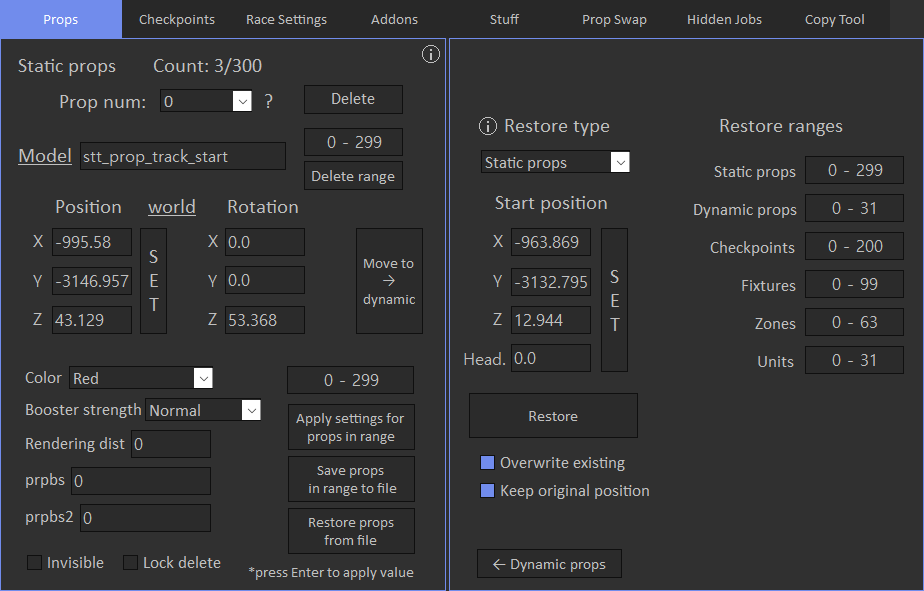
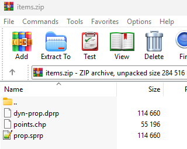
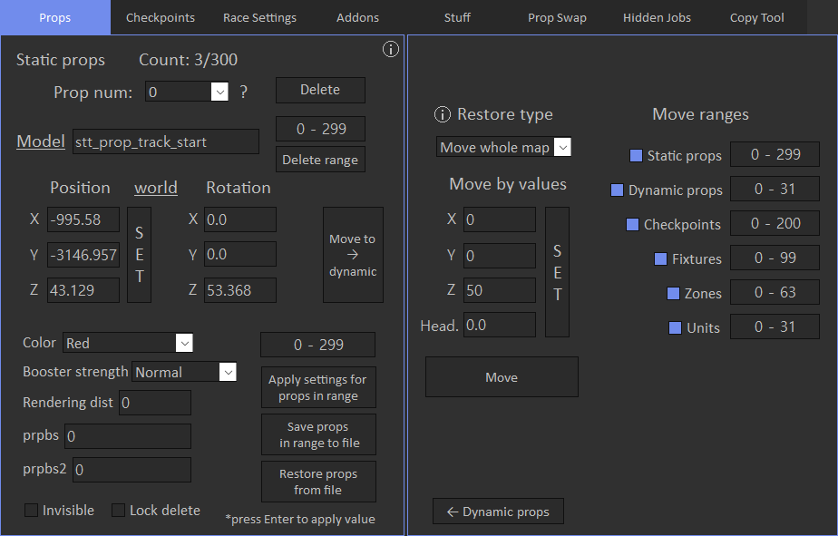

# Advanced Restore

Advanced restore allows to restore various items from the reference position.

It basically means that you can move your map to another location.

If 'Overwrite exising' checkbox is checked, exising items will be replaced with the restored ones, otherwise restored items will be appended.

If 'Keep original position' checkbox is checked, reference position will be ignored.

You can specify restore range of the items. This range is applied to the file.

Supported formats for XML maps are Spooner and Map Editor.

For example you can save props to file from the map that was built in the city, then set Start position to cursor coordinates in the airport and press Restore.

Note that 'Keep original position' checkbox must be disabled if you want to move items to a different place.

If restored props are partially under map, you may need adjust Z coordinate of Start position.

But if you restore props and checkpoints separately, their position will not match. To fix it, there's an All in one restore option.

All in one option accepts zip file that may contains props, dynamic props, checkpoints, fixtures and units. Files can have different names, only file extension is important.

## Move whole map

You can move whole map in one click with 'Move whole map' option.

'Move by values' will be added to the coordinates of the items.

For example, if you want to move map upwards, you need to specify only positive Z value and set other ones to 0.

You can also rotate whole map if you specify Heading. In this case, map will be rotated around first prop.

You can toggle items that will be moved and also specify ranges for them.

**Note**: rotate map will not work correctly for zones with type 'Axis alligned box' because it cannot be rotated.

**Note**: keep in mind that trigger coordinates will also be updated.