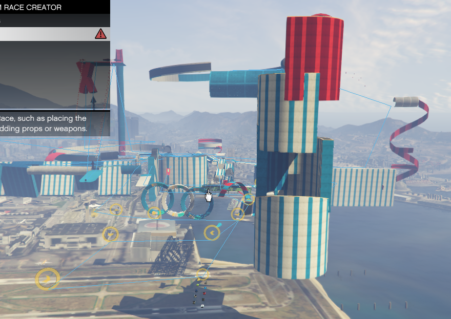

# Advanced Restore

Advanced restore allows to restore various items from the reference position.

It basically means that you can move your map to another location.

If 'Overwrite exising' checkbox is checked, exising items will be replaced with the restored ones, otherwise restored items will be appended.

If 'Keep original position' checkbox is checked, reference position will be ignored.

Supported restore options are props, dynamic props and checkpoints and others.

Supported formats for XML maps are Spooner and Map Editor.

For example you can save props to file from the map that was built in the city, then set Start position to cursor coordinates in the airport and press Restore.

Note that 'Keep original position' checkbox must be disabled if you want to move items to a different place.

If restored props are partially under map, you may need adjust Z coordinate of Start position.

But if you restore props and checkpoints separately, their position will not match. To fix it, there's an All in one restore option.

All in one option accepts zip file that may contains props, dynamic props, checkpoints, fixtures and units. Files can have different names, only file extension is important.

