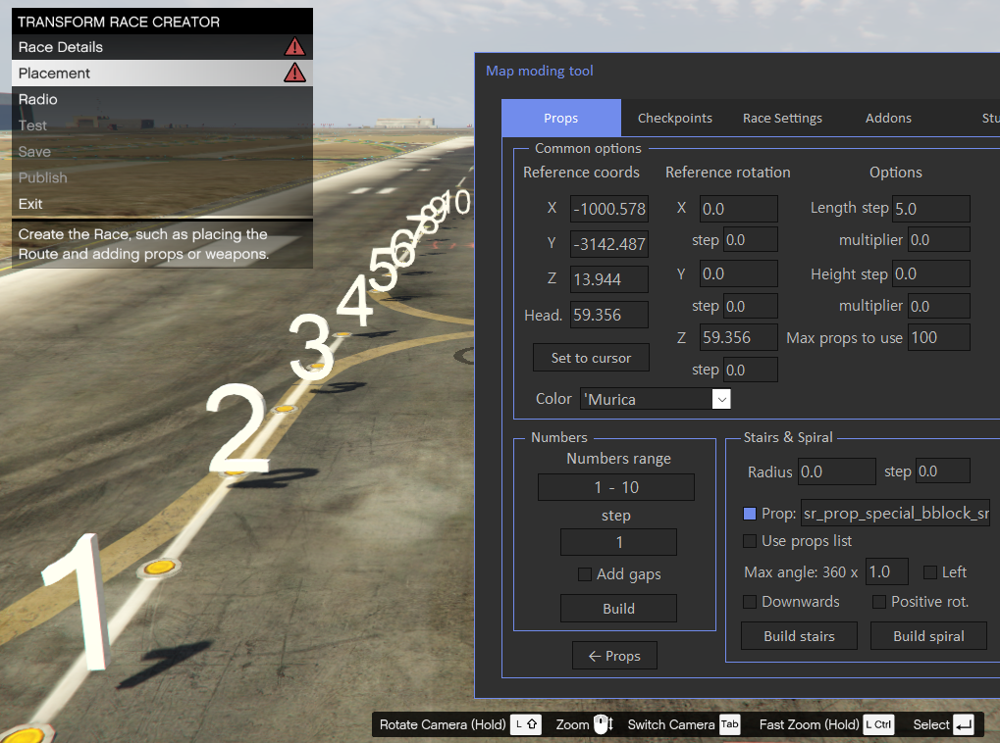
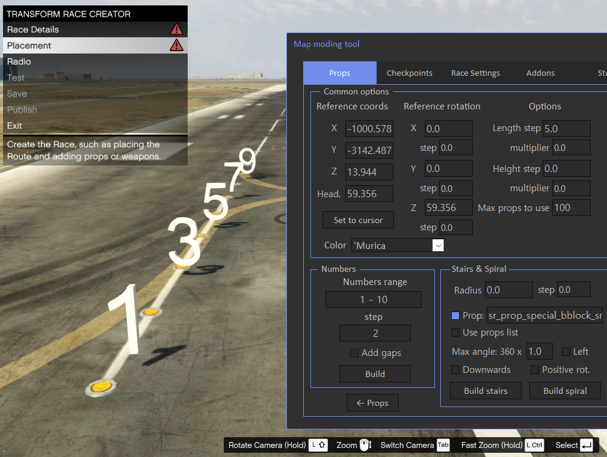
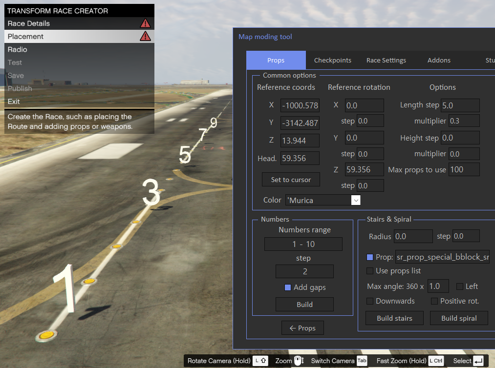
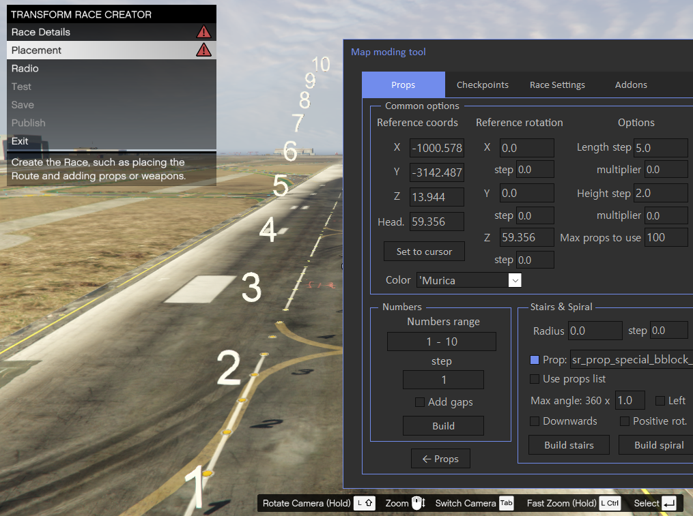
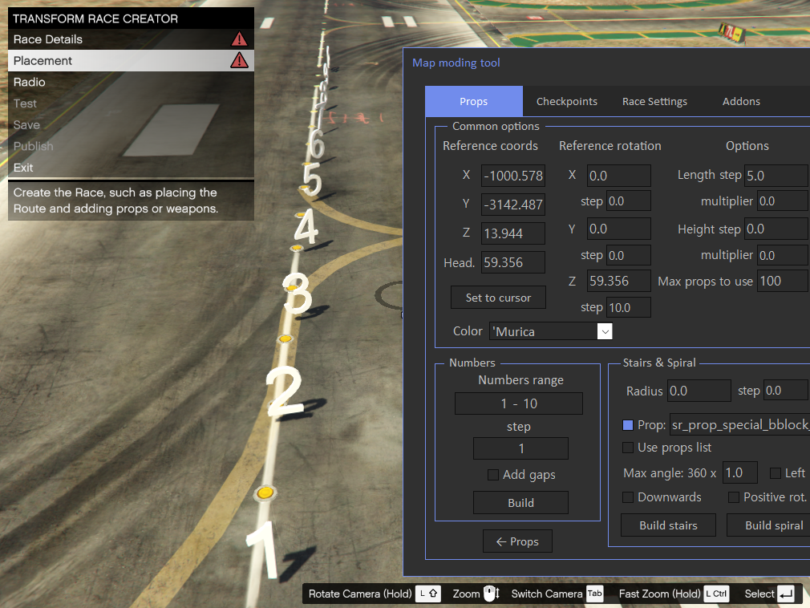

# Numbers Preset

Numbers preset places number props in a line.

Following settings will result in numbers placed in line:
 

Step will add specified value to the number props, for example if step is 2 you will get following result:

If step is greater than 1, you can check 'Add gaps' checkbox, it will add gaps to the skipped numbers:

Also you can set Height step, it will result is following placement:

If you set step for rotation, in this case step 10 for Z rotation coordinate, props be will rotated on each iteration:

