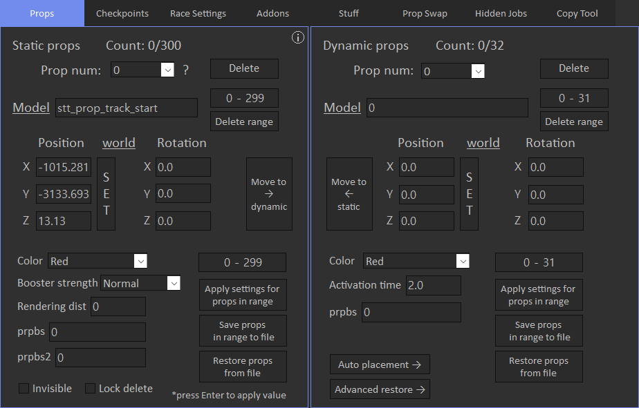

# Props

Props tab allows to view and modify placed props.

Location tips: 

- Position and rotation are not auto-applied after editing, you need to press Enter to apply changes.
- 'SET' button sets cursor position to the appropriate position fields.
- Position and rotation support arrow control(it depends on world/local alignment), more on [Arrow Control](../../tips/arrow-control) page.

Rendering dist:

- Sets distance from which prop will become visible.
- To make prop invisible, set it to 1.
- Max value is 65000.

Prpbs and prpbs2 are for advanced users, it's a bit set for various prop options.

To make prop invisible, you may also activate Invisble checkbox, but unfortunately it does not work for stunt props in online mode, so it's better to modify rendering distance.

Activation time controls dynamic arena traps activation delay in seconds.

Bulk edit:

- You can bulk edit prop options(except for position/rotation) by typing desired props range and pressing 'Apply settings for props in range' button.
- To skip some options for bulk editing, select 'Don't apply' option from dropdown.

Yeah I know bulk edit is a bit weird, but maybe i'll rework it in the future.

There are save and restore options:

- Save options depends on specified props range.
- Restore options doesn't overwrite exising props, it appends them.

You can move props from static to dynamic(or vice versa) in a convenient way by pressing Move to static/dynamic button.