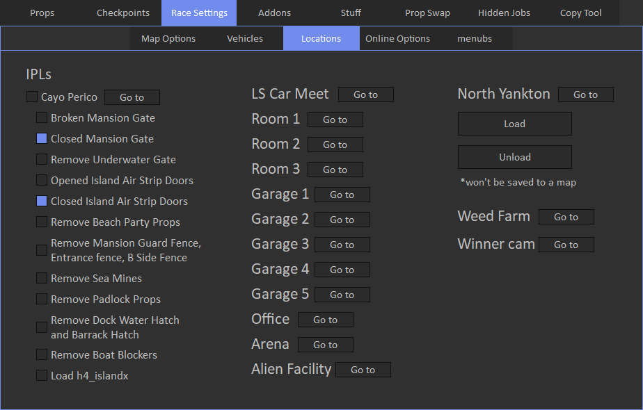

# Locations

Locations tab allows to load IPLs.

There are also options to customize things on the Cayo Perico. 
**Note:** for Cayo Perico to work in online race, you must set trigger location anywhere in the city, but not on the island, and then use Save/Publish button in the tool.

You can configure mansion options:

- Custom interior override - mansions interior will be overriden with your purchased mansion(like dog house, etc.), works only in online mode.
- Open valut door: if checked, vault door will be opened in all mansions, works only in online mode.
- Opened: if checked, mainsion can be accessed through doors. Interior is not loaded in creator, but it is in online mode.
- Shutters - show or hide mansion shutters.

LS Car Meet location is under textures, so it's better to explore it when you switch from free camera to vehicle.

Other interiors may not be loaded instantly when you teleport to them, as a workaround you can set checkpoint to interior location and then respawn at this point in test mode.

North Yankton can only be loaded in creator. 
**WARNING:** it cannot be saved to the map, it means yankton will not be loaded in online race.