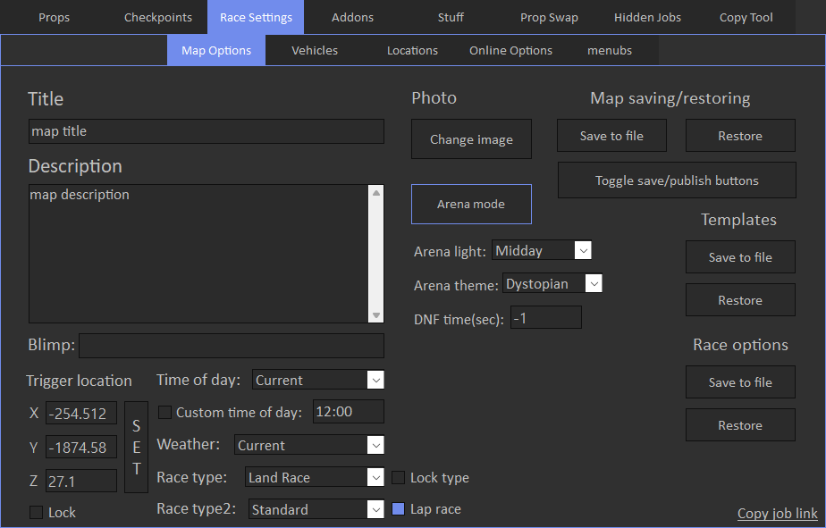
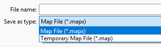

# Map Options

Map options tab allows to view and modify global settings of the map.

'Lock' option for trigger locks it's coordinates so they cannot be changed. This can be useful when you often toggle arena mode, so trigger coordinates will not be overriden by the game.

'Lock type' for race type also locks it's so it will not be overriden by the game. Sometimes it can be useful when race type automatically changes when you save your race.

'DNF time(sec)' sets race end time in seconds after half of the players finished the race. -1 means use default value, which is 30 seconds.

Tire wear settings are used only for Open Wheel race types.

You can also save and restore whole map with all the settings.

There are 2 types of map save files:

It's recommended to always use first one(.mapx), because it can be restored both on Legacy and Enhanced versions. This type also contains image of your map.

Second one(.map) is temporary. It's only valid in scope of the game version that is was saved on, it means that after next DLC previously saved map files become invalid.
Also you cannot restore it on Enhanced if it was save on Legacy and vise versa, and it does not contain image data.
This format is used in [Map Auto Save](../../../stuff/overview) feature.

In both cases, Restore overwrites currently loaded map, so if you want to create copy, restore it on empty race.

Saved templates and race options files are independant to game updates.

Race options file contains all settings from all sub tabs under Map Options, except for title, description and trigger.
Also it saves available vehicles for random transform race type.