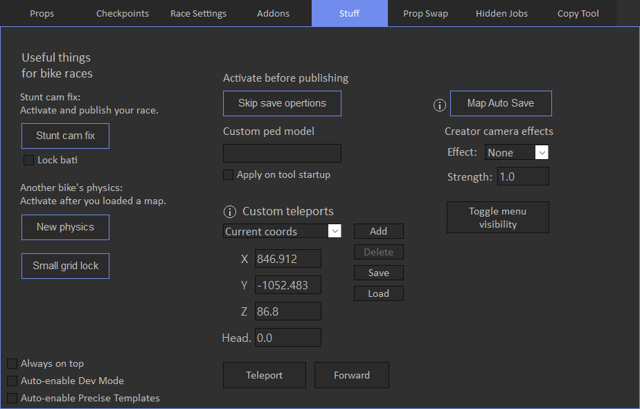

# Stuff

Stuff tab contains some small features.

'Skip save operations' may fix some rare issues like disappearing of points after publishing, you need to activate it and publish your race. 

You can replace default creator ped model with custom one, also you can check 'Apply on tool startup' checkbox to automatically replace ped model.

'Map Auto Save' allows to automatically save map to the file in the specified directory.
It saves map every 10 seconds, so for example if game crashed unexpectedly, you will not loose your progress.
You can laster restore map file on the [Map Options](../../race-settings/map-options/overview) tab.

There are some camera effects under 'Creator camera effects'. You can change strength of the effect and effect type.

'Toggle menu visibility' allows to hide creator menu.

'Custom teleports' allow you to teleport to the specific coordinates. Also you can save custom locations and later restore them.

Useful thing for bike races include stunt cam fix, so you can use stunt props on your map without silly stunt camera. 
There's also another physics options, it converts your race to open wheel type. Wallclimbs and jumps work worse with this mode than on normal map.

'Small grid lock' locks start grid size for 15 seconds to the small type, so you have some time to place start grid.
Timer is needed because there may be some glitches in creator if small grid type is always present.

When 'Always on top' is checked, tool stays on top above other processes.

If 'Auto-enable Dev Mode' checkbox is checked, Dev Mode will be automatically enabled on tool startup. Same for Precise Templates.

'Save logs' saves log files in zip archive, for example if you have some errors, you can upload this file on the discord server for investigation.