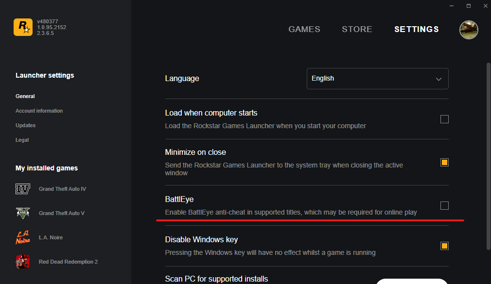
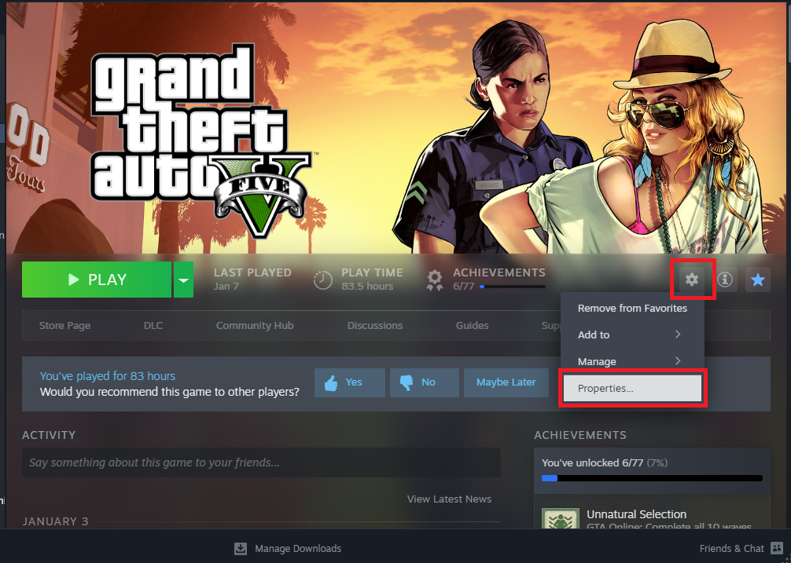
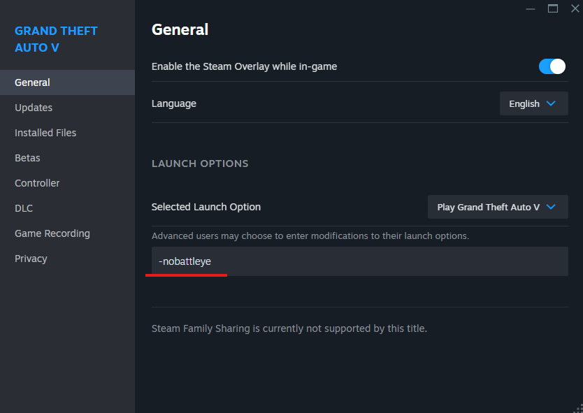
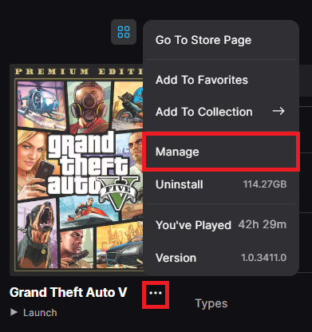
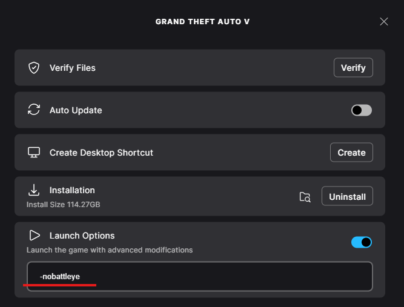

# Disable BE

Disabling BE depends from where you launch the game.

## Rockstar Games Launcher  

1. Open Rockstar Games Launcher.
2. Click on Settings (located in the top-right corner).
3. Uncheck the BattlEye box.



## Steam

1. Open Steam.
2. Go to Grand Theft Auto V page.
3. Open Settings -> Properties.
5. Write -nobattleye in the Launch Options box.





## Epic Games

1. Open Epic Games Launcher.
2. Click on Library.
3. Navigate to Grand Theft Auto V's thumbnail and click on the three dots below it.
4. Now click on Manage.
5. Enable Launch Options in the newly opened menu and write -nobattleye in the box.



