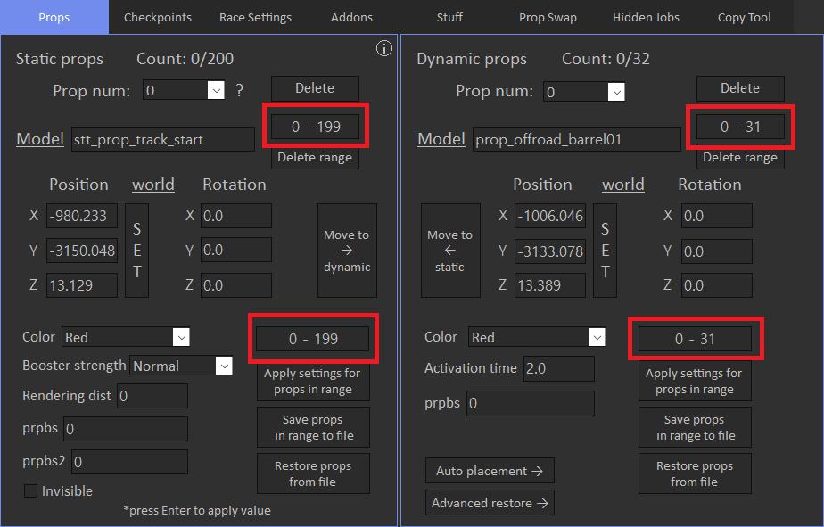

# Range Formats

Ranges allow to bulk save, delete or apply settings for items. It applies across all tabs where ranges are supported.

Let's take a look at the props tab:

You can specify custom ranges based on this examples:

- "0 - 199" - props from 0 to 199 will be processed, total count is 200.
- "6" - only 6th will be processed, total count is 1.
- "0,2,8,20" - 0th, 2nd, 8th and 20th props will be processed, total count is 4.
- "2,4,10-20" - 2nd, 4th and props from 10 to 20 will be processed, total count is 12.

Comma "," separator means items should be process separately, and "-" separator means to process items "from - to". You can combine them.